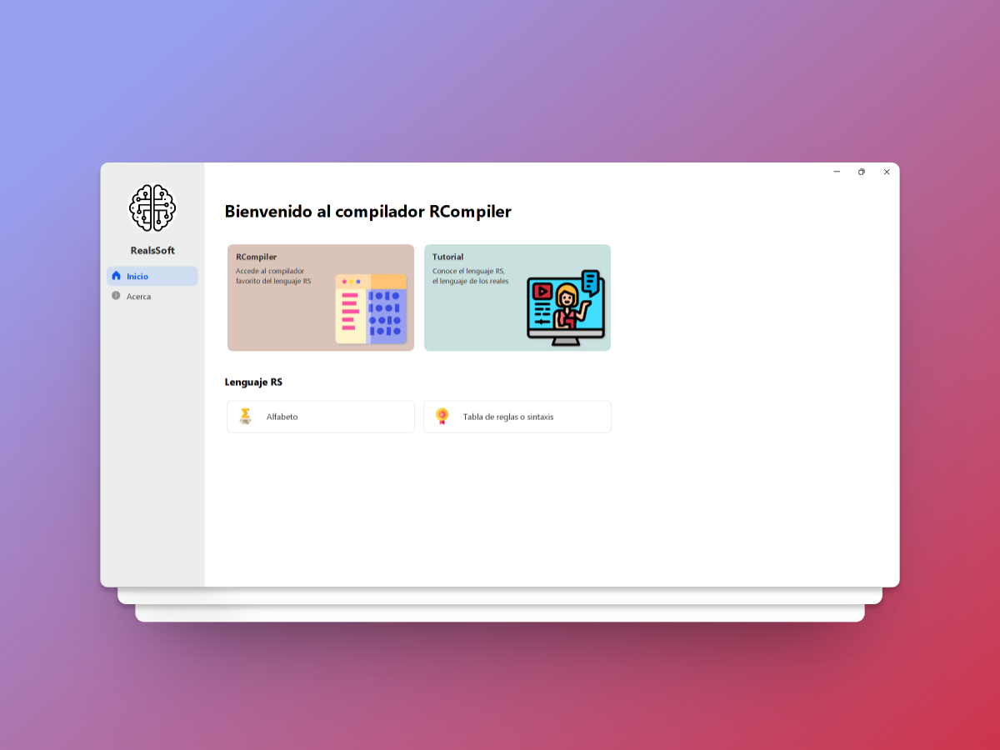
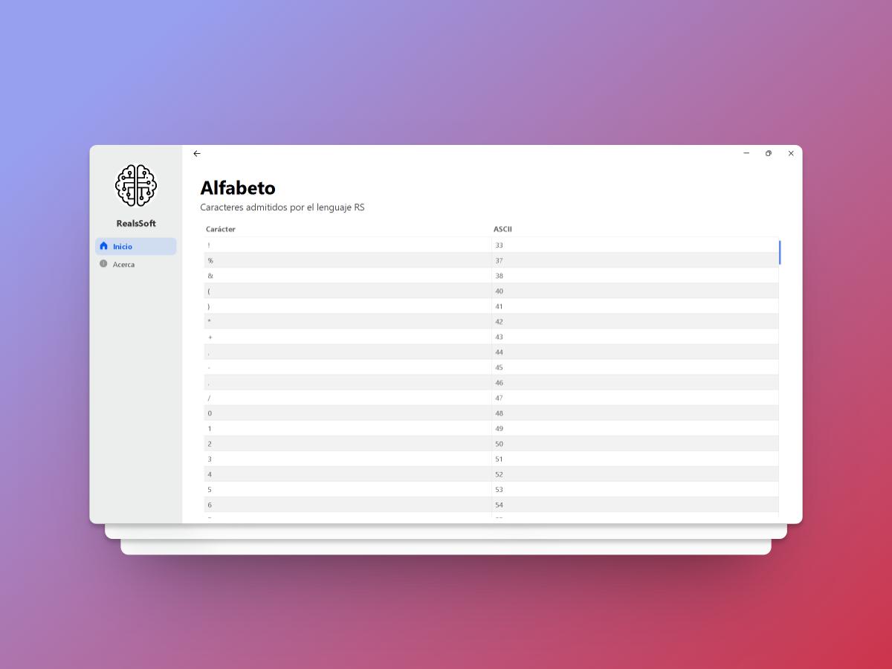
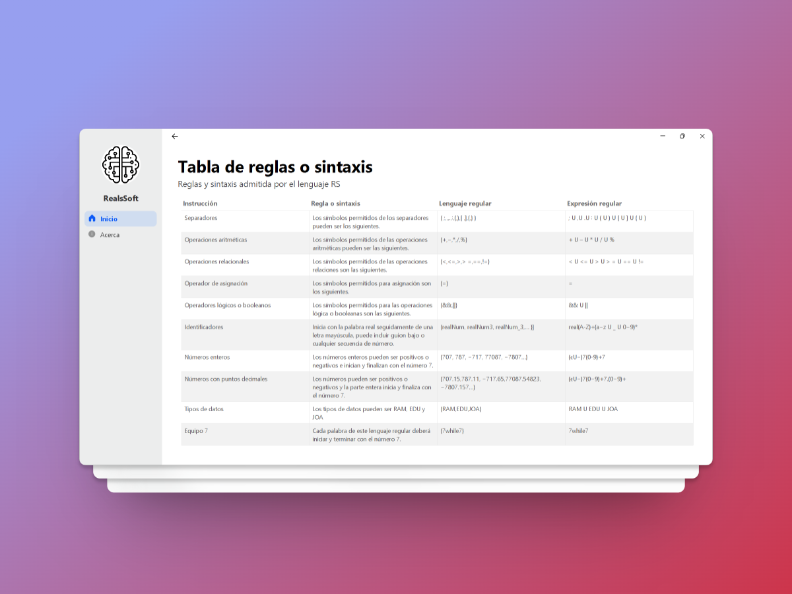
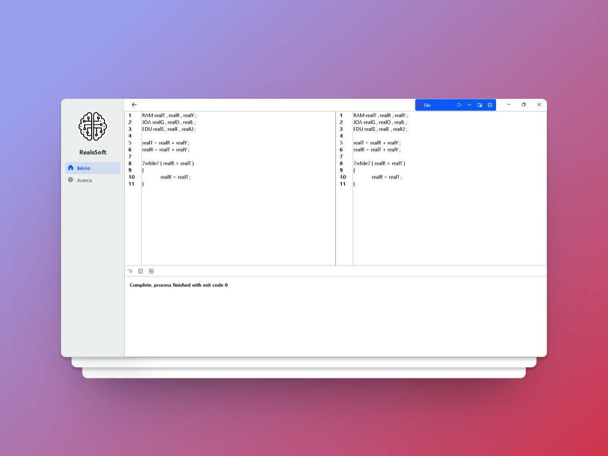

# Proyecto Compilador R

## Descripción

El proyecto un compilador realizado en Java que incluye
el analizador lexico, sintactico y semantico.

## Navega por el sistema
1. Pantalla de inicio.

2. Pantalla de caracteres aceptados.

3. Pantalla de reglas.

4. Pantalla del compilador.
